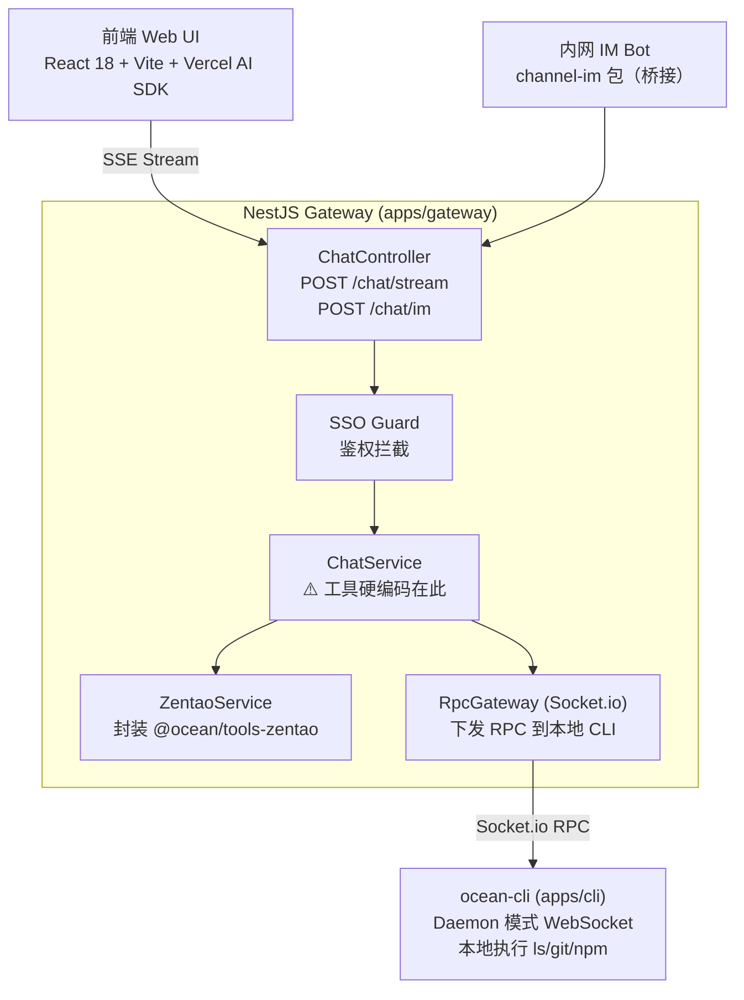
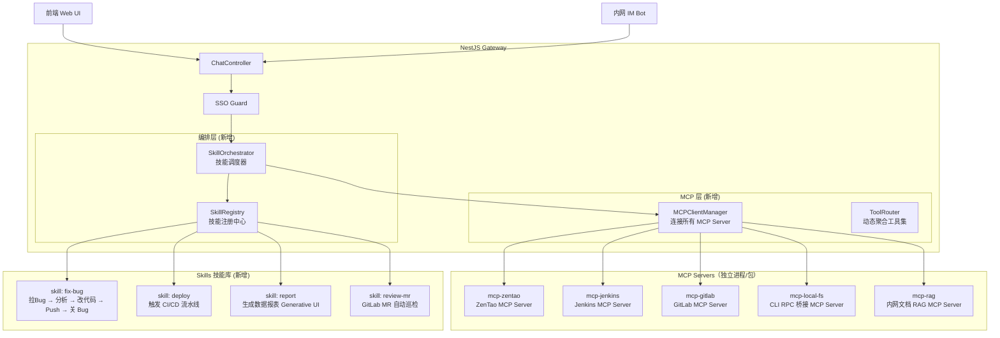

# Ocean 架构现状 & MCP + Skill 升级方案

---

## 一、当前技术架构现状（As-Is）

### 1.1 整体拓扑



### 1.2 工具层现状（问题所在）

```typescript
// ❌ 当前：所有工具硬编码在 ChatService.getTools() 里
private getTools() {
  return {
    getBugInfo: tool({ ... }),     // 内嵌
    searchBugs: tool({ ... }),     // 内嵌
    resolveBug: tool({ ... }),     // 内嵌
    runLocalCommand: tool({ ... }) // 内嵌
  };
}
```

### 1.3 当前架构的核心问题

| 问题 | 描述 | 影响 |
|------|------|------|
| **工具硬编码** | 所有工具 `getBugInfo / runLocalCommand` 直接写死在 `ChatService` | 无法动态扩展，加新工具需改核心代码 |
| **权限无隔离** | 工具无 per-tool 权限声明，全凭 System Prompt 约束 | LLM 可能越权调用 |
| **无工作流编排** | LLM 一次性调用所有工具，没有 Plan → Act 的多步骤 Skill 概念 | 复杂任务（如场景 B）靠 LLM 自行摸索，不可控 |
| **CLI 方法枚举死板** | `switch(data.method)` 枚举 7 个方法 | 无法动态注册新本地能力 |
| **无 Prompt 注入机制** | `.AIGUIDE.md` 未实际读取注入 System Prompt | PRD 愿景未实现 |

---

## 二、目标架构（To-Be）：引入 MCP + Skill

### 2.1 核心设计理念

**MCP（Model Context Protocol）**  
> 将每一个「工具集」封装成标准化的独立服务（MCP Server），Gateway 作为 MCP Client 动态发现和调用能力，而非硬编码工具列表。

**Skill（技能编排层）**  
> 将复杂的多步骤工作流（如「拉 Bug → 分析代码 → 改代码 → Push → 关闭 Bug」）封装成一个具名 Skill，由 SkillOrchestrator 统一调度。

### 2.2 新架构拓扑



---

## 三、改造详细方案

### 3.1 MCP Server 规范（每个工具集独立封装）

每个 MCP Server 遵循 **MCP 标准协议**（基于 `@modelcontextprotocol/sdk`）:

```typescript
// packages/mcp-zentao/src/server.ts
import { McpServer } from '@modelcontextprotocol/sdk/server/mcp.js';
import { StdioServerTransport } from '@modelcontextprotocol/sdk/server/stdio.js';
import { z } from 'zod';

const server = new McpServer({ name: 'ocean-zentao', version: '1.0.0' });

// 工具声明：标准化 Schema + 权限标注
server.tool('getBugInfo', {
  description: '获取禅道缺陷详情',
  inputSchema: z.object({ bugId: z.string() }),
  // MCP 扩展：声明所需的权限级别
  annotations: { readOnly: true, requiredRole: 'developer' }
}, async ({ bugId }) => {
  return { content: [{ type: 'text', text: JSON.stringify(await zentao.getBugInfo(bugId)) }] };
});

server.tool('resolveBug', {
  description: '将缺陷标记为已解决',
  inputSchema: z.object({ bugId: z.string() }),
  annotations: { readOnly: false, requiredRole: 'developer', requireConfirm: true }
}, async ({ bugId }) => { ... });

const transport = new StdioServerTransport();
await server.connect(transport);
```

### 3.2 MCPClientManager（Gateway 侧动态发现）

```typescript
// apps/gateway/src/mcp/mcp-client.manager.ts
import { Client } from '@modelcontextprotocol/sdk/client/index.js';
import { StdioClientTransport } from '@modelcontextprotocol/sdk/client/stdio.js';

@Injectable()
export class MCPClientManager implements OnModuleInit {
  private clients = new Map<string, Client>();
  private allTools: Record<string, ToolDefinition> = {};

  async onModuleInit() {
    // 从配置动态加载 MCP Server 列表
    const servers = this.configService.get<MCPServerConfig[]>('MCP_SERVERS');
    for (const srv of servers) {
      await this.connectServer(srv);
    }
  }

  private async connectServer(config: MCPServerConfig) {
    const transport = new StdioClientTransport({
      command: config.command, // e.g. 'node'
      args: config.args,       // e.g. ['packages/mcp-zentao/dist/server.js']
    });
    const client = new Client({ name: 'ocean-gateway', version: '1.0.0' });
    await client.connect(transport);

    // 动态拉取工具列表注册到聚合路由
    const { tools } = await client.listTools();
    for (const t of tools) {
      this.allTools[t.name] = { ...t, clientId: config.id };
    }
    this.clients.set(config.id, client);
  }

  // 向 AI SDK 提供聚合后的工具集
  getAITools(): Record<string, any> {
    return Object.fromEntries(
      Object.entries(this.allTools).map(([name, def]) => [
        name,
        tool({
          description: def.description,
          inputSchema: def.inputSchema,
          execute: async (params) => {
            const client = this.clients.get(def.clientId);
            const result = await client.callTool({ name, arguments: params });
            return result.content;
          }
        })
      ])
    );
  }
}
```

### 3.3 Skill 技能定义规范

每个 Skill 是一个**声明式的多步骤工作流**：

```typescript
// apps/gateway/src/skills/fix-bug.skill.ts
import { Skill, SkillContext, SkillStep } from '../skill/types';

export const fixBugSkill: Skill = {
  name: 'fix-bug',
  description: '完整的 Bug 修复工作流：拉取详情 → 分析 → 代码修复 → Push → 关闭缺陷',
  
  // 触发意图识别（LLM 根据用户输入匹配技能）
  triggers: ['fix bug', '修复', '解决缺陷', 'ocean fix'],

  // 输入参数 Schema
  inputSchema: z.object({
    bugId: z.string().describe('禅道缺陷 ID'),
    userId: z.string(),
  }),

  // 步骤声明（Plan Mode 的核心）
  steps: [
    { id: 'fetch',   tool: 'getBugInfo',      description: '拉取缺陷详情' },
    { id: 'analyze', tool: 'readLocalFile',   description: '读取相关源文件', dependsOn: ['fetch'] },
    { id: 'patch',   tool: 'applyPatch',      description: '应用代码修复',   requireConfirm: true },
    { id: 'commit',  tool: 'git_commit',      description: '提交改动',       requireConfirm: true },
    { id: 'close',   tool: 'resolveBug',      description: '关闭禅道缺陷',   dependsOn: ['commit'] },
  ],

  // .AIGUIDE.md 注入（团队规范强制注入到 System Prompt）
  aiguideEnabled: true,
};
```

### 3.4 SkillOrchestrator（核心调度器）

```typescript
// apps/gateway/src/skill/skill.orchestrator.ts
@Injectable()
export class SkillOrchestrator {
  constructor(
    private mcpManager: MCPClientManager,
    private skillRegistry: SkillRegistry,
    private aiguideLoader: AiguideLoader, // 读取 .AIGUIDE.md
  ) {}

  async execute(userMessage: string, context: RequestContext): Promise<AsyncIterable<string>> {
    // 1. 意图识别：匹配合适的 Skill 或走通用模式
    const skill = this.skillRegistry.matchSkill(userMessage);

    // 2. 获取系统 Prompt（含 .AIGUIDE.md 注入）
    const systemPrompt = await this.buildSystemPrompt(context, skill);

    // 3. 获取工具集（从 MCP 动态拉取）
    const tools = this.mcpManager.getAITools();

    if (skill) {
      // 走 Skill Plan Mode：先展示计划，等待用户确认（Web 端）
      return this.executeSkillMode(skill, userMessage, systemPrompt, tools, context);
    } else {
      // 走通用 ReAct 模式
      return this.executeReActMode(userMessage, systemPrompt, tools, context);
    }
  }

  private async buildSystemPrompt(ctx: RequestContext, skill?: Skill): Promise<string> {
    let base = `你是银行内网 AI 助手 Ocean。用户工号: ${ctx.userId}`;
    
    // 注入 .AIGUIDE.md 团队规范
    if (skill?.aiguideEnabled || ctx.hasLocalCli) {
      const guide = await this.aiguideLoader.load(ctx.workspacePath);
      if (guide) base += `\n\n## 团队开发规范（.AIGUIDE.md）\n${guide}`;
    }

    return base;
  }
}
```

---

## 四、新目录结构

```text
ocean/
├── apps/
│   ├── web/              # 前端（不变）
│   ├── gateway/
│   │   └── src/
│   │       ├── mcp/              # 🆕 MCP 层
│   │       │   ├── mcp-client.manager.ts
│   │       │   └── mcp.module.ts
│   │       ├── skill/            # 🆕 Skill 编排层
│   │       │   ├── skill.orchestrator.ts
│   │       │   ├── skill.registry.ts
│   │       │   ├── aiguide.loader.ts
│   │       │   └── skill.module.ts
│   │       ├── skills/           # 🆕 技能定义库
│   │       │   ├── fix-bug.skill.ts
│   │       │   ├── deploy.skill.ts
│   │       │   ├── report.skill.ts
│   │       │   └── review-mr.skill.ts
│   │       ├── auth/             # 不变
│   │       └── chat/             # 简化：不再硬编码工具
│   └── cli/
│       └── src/
│           └── index.ts          # 🔄 switch 改为动态 method 注册
└── packages/
    ├── mcp-zentao/       # 🆕 禅道 MCP Server（标准协议）
    ├── mcp-jenkins/      # 🆕 Jenkins MCP Server
    ├── mcp-gitlab/       # 🆕 GitLab MCP Server
    ├── mcp-local-fs/     # 🆕 本地 FS/CLI RPC 桥接 MCP Server
    ├── mcp-rag/          # 🆕 内网文档 RAG MCP Server
    ├── tools-zentao/     # 保留（供 mcp-zentao 内部调用）
    ├── channel-im/       # 保留
    └── shared-types/     # 扩展 Skill/MCP 类型
```

---

## 五、改造优先级与路径

### Phase 1：MCP 化（2-3 天）
- [ ] 安装 `@modelcontextprotocol/sdk`
- [ ] 将 `tools-zentao` 改造为标准 `mcp-zentao` Server
- [ ] 在 Gateway 创建 `MCPClientManager` 替换硬编码 `getTools()`
- [ ] 配置文件驱动 MCP Server 列表（`mcp.config.json`）

### Phase 2：Skill 层（3-5 天）
- [ ] 定义 `Skill` 接口与类型
- [ ] 实现 `SkillRegistry`（意图匹配） + `SkillOrchestrator`（步骤执行）
- [ ] 实现 `AiguideLoader`（`.AIGUIDE.md` 文件读取注入）
- [ ] 开发首个 Skill：`fix-bug`（覆盖场景 A/H）

### Phase 3：扩展 MCP Servers（按需）
- [ ] `mcp-jenkins`（场景 B）
- [ ] `mcp-gitlab`（场景 G）
- [ ] `mcp-rag`（场景 E）
- [ ] `mcp-local-fs`（CLI 动态方法注册，替代 switch 枚举）

---

## 六、关键收益对比

| 维度 | 改造前 | 改造后 |
|------|--------|--------|
| **扩展工具** | 改 `ChatService` 源码 | 新增独立 MCP Server 包，零侵入 |
| **工作流编排** | LLM 自行摸索 | Skill 声明式多步骤，可预期 |
| **权限控制** | System Prompt 文字约束 | MCP `annotations` 标准声明 |
| **团队规范注入** | 未实现 | `.AIGUIDE.md` 自动注入 System Prompt |
| **CLI 扩展** | `switch` 枚举 7 个方法 | `mcp-local-fs` 动态注册任意方法 |
| **可观测性** | `console.log` | MCP 标准协议可接入 LangSmith/Zipkin |

> [!IMPORTANT]
> **Phase 1（MCP化）是最高优先级**，它解耦工具层，后续所有 Skill 都依赖于动态工具路由机制。

